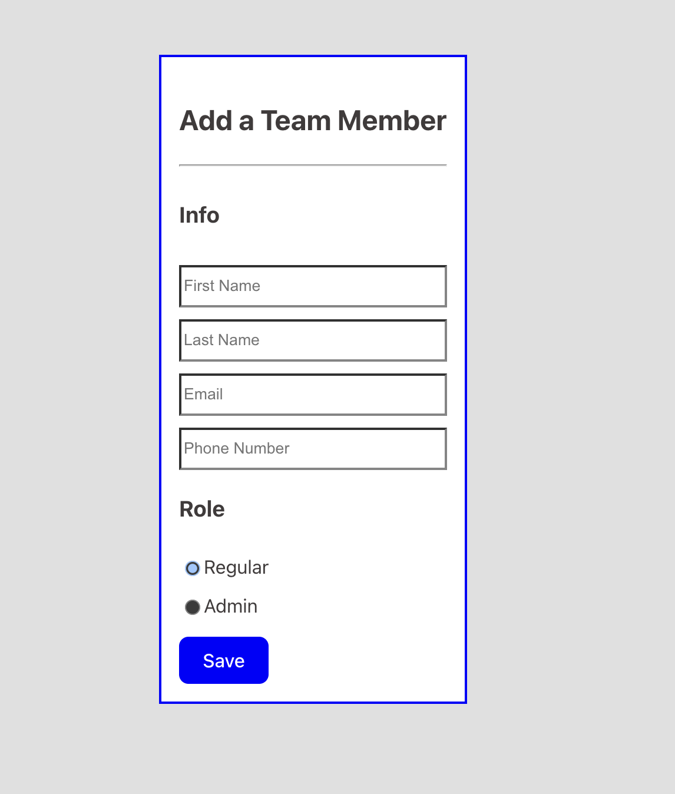
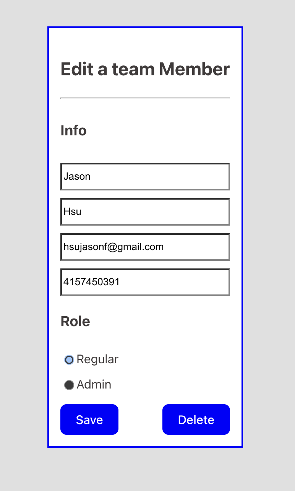

# React + Vite

# team_management_fe

## Setup

The first thing to do is to clone the repository:

```sh
$ git clone https://github.com/hsujasonf/team_management_fe
$ cd team_management_fe
```

Install the dependencies:

```sh
(env)$ npm install
```

```sh
(env)$ cd team_management_fe
(env)$ npm run dev
```




